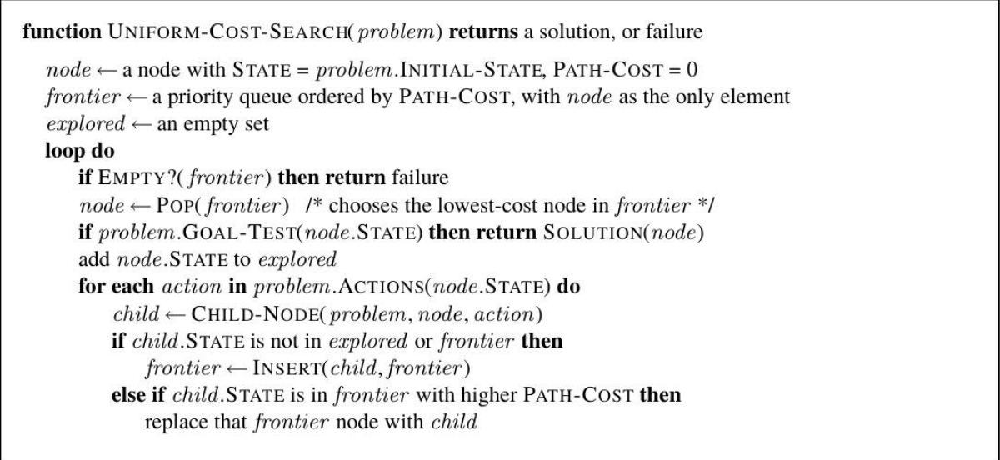
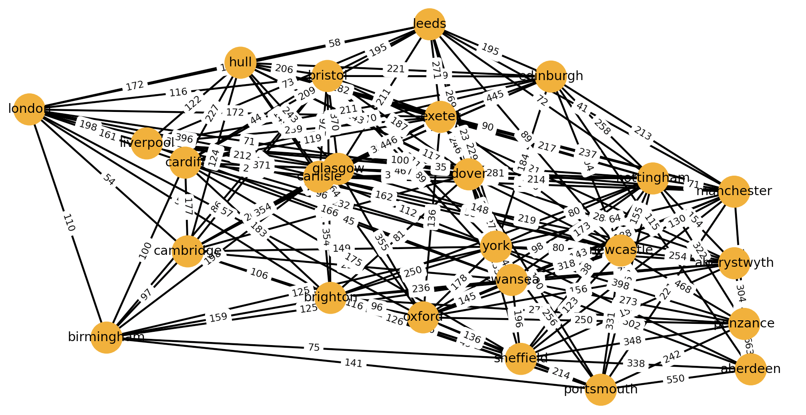
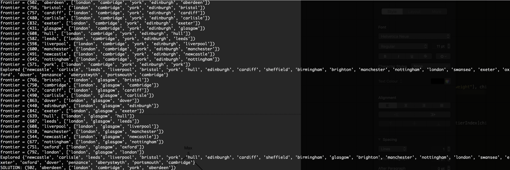

# UniformCostSearch-Shortest_path_between_2_UK_cities
Implementation of  UCS algorithm in Python using Networkx library.
Pseudo code for UCS algorithm is borrowed from the book "Artificial Intelligence: A Modern Approach" 

The script loads a UK map encoded as a JSON file. The file encodes all the roads between major cities of the UK with their length of the road(in km). UCS is implemented using a priority queue to find the shortest path and the cost to get from city A to city B.

<b>Graph of the map</b>

<b>Shortest path from London to Aberdeen</b>

